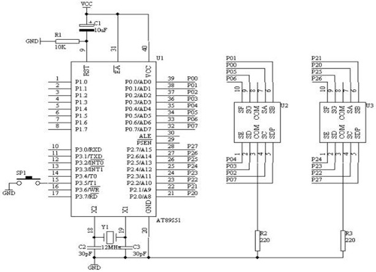

**Digital Stopwatch Using ATMEL 8051 Microcontroller
**
This project involves designing a digital stopwatch using an ATMEL 8051 microcontroller. The stopwatch features a seven-segment LED display for visual output, and its circuit is designed using PCB layout techniques. The core functionality is controlled through embedded C programming.

Key Features:
Start/Stop Functionality: A switch is used to start and stop the stopwatch. Restarting from zero requires pressing the switch again.
Microcontroller-based Control: The stopwatch operates based on instructions executed by the ATMEL 8051 microcontroller.
Embedded C Programming: The control logic is implemented using the KEIL compiler.

Microcontroller Overview: ATMEL 89C51
The AT89C51 microcontroller belongs to the 8051 family, featuring:
4K Bytes of Flash Memory
128 Bytes of RAM
32 I/O Lines
Two 16-bit Timer/Counters
Full Duplex Serial Communication
On-chip Oscillator & Clock Circuitry
Power-Saving Modes:
Idle Mode: CPU halts but peripherals remain active.
Power-Down Mode: Retains RAM data while freezing the oscillator.

Chip Layout & Pin Description
Power & Ground Pins
VCC: Supply voltage.
GND: Ground connection.
I/O Ports
Port 0: 8-bit bi-directional, used for address/data bus multiplexing.
Port 1: 8-bit bi-directional with internal pull-ups.
Port 2: 8-bit bi-directional, used for high-order address bytes in external memory operations.
Port 3: 8-bit bi-directional, supporting special functions such as serial communication and external interrupts.
Oscillator & Reset Pins
XTAL1 & XTAL2: Connects an external crystal oscillator for clock generation.
RST: Reset input to restart the microcontroller.
Other Functional Pins
ALE/PROG: Address Latch Enable, used during external memory access.
PSEN: Program Store Enable, for external memory execution.
EA/VPP: External Access Enable, determines internal/external memory execution.

Project Implementation
Hardware Requirements
ATMEL 89C51 Microcontroller
Seven-Segment LED Display
Push Button for Start/Stop
Power Supply (5V DC)
PCB Layout & Circuit Assembly
Software Tools
KEIL uVision (for C programming and compilation)
Proteus (for circuit simulation)
PCB Design Software (for layout creation)

Conclusion
This project successfully demonstrates the implementation of a digital stopwatch using the ATMEL 8051 microcontroller. The stopwatch features:
Accurate timekeeping
Minimal hardware complexity
Efficient C programming for microcontroller control
Future improvements could include adding a display interface using LCD, enhancing accuracy using external quartz oscillators, or integrating wireless control for remote operations.

References
"8051 Microcontroller" - I. Scott Mackenzie
"The Intel Microprocessors" - Barry B. Brey

